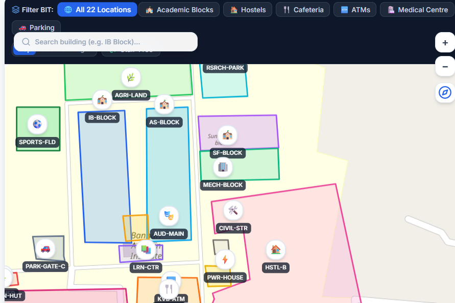
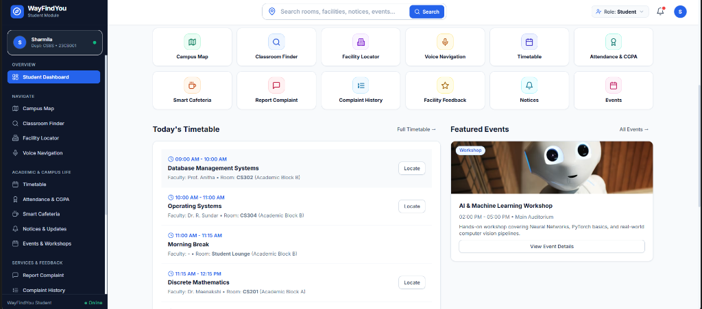
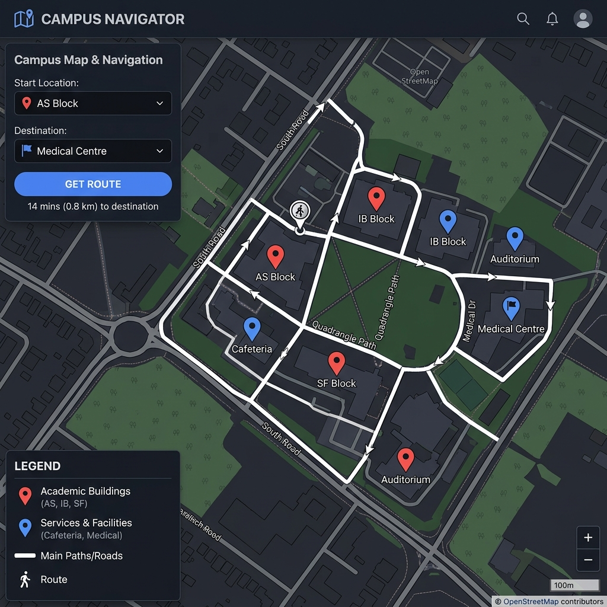
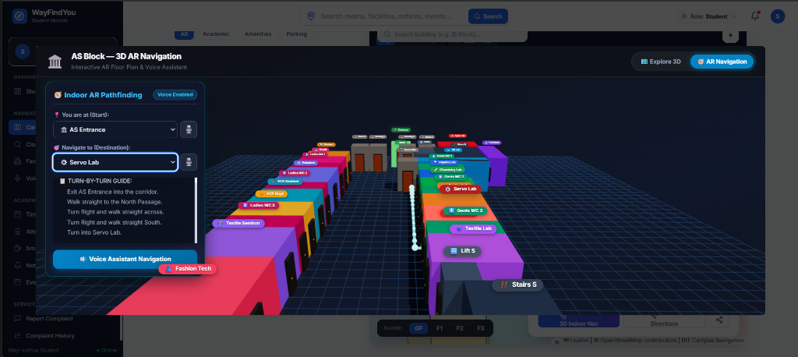
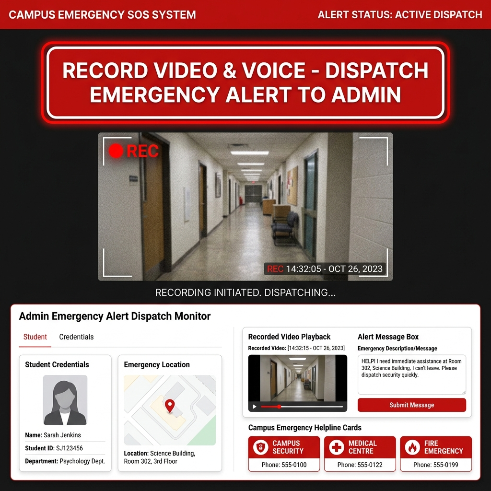
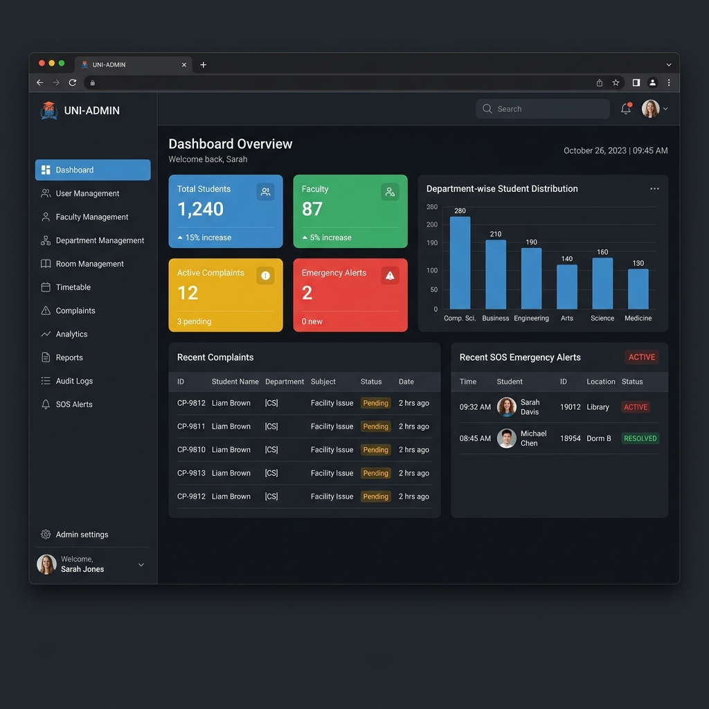

# 🏫 WayFindYou

**Smart Campus Navigation & Facility Locator**
*Bannari Amman Institute of Technology, Sathyamangalam*

[](https://reactjs.org) [](https://vitejs.dev) [](https://threejs.org) [](https://leafletjs.com) [](LICENSE)

> Developed by **Team Velmora** · CSE Department · 2024–2025

---

## 📌 Table of Contents

| | Section |
|---|---------|
| 1 | [Project Overview](#-project-overview) |
| 2 | [System Architecture](#-system-architecture) |
| 3 | [Key Features](#-key-features) |
| 4 | [UI Screenshots](#-ui-screenshots) |
| 5 | [Tech Stack](#-tech-stack) |
| 6 | [Project Structure](#-project-structure) |
| 7 | [Setup & Installation](#-setup--installation) |
| 8 | [User Roles](#-user-roles) |
| 9 | [Emergency SOS](#-emergency-sos-system) |
| 10 | [Team Velmora](#-team-velmora) |

---

## 🌟 Project Overview

WayFindYou is a smart campus navigation platform for **Bannari Amman Institute of Technology**.
It combines outdoor map routing, 3D indoor navigation, voice commands, and a real-time emergency SOS system — all in one web application.

**Who is it for?**

- 🧑‍🎓 **Students** — find classrooms, facilities, and get help in emergencies
- 👨‍🏫 **Faculty** — navigate campus and manage schedules
- 👩‍💼 **Admins** — manage users, rooms, complaints, and monitor SOS alerts

---

## 🏗️ System Architecture

<div align="center">



</div>

```
Presentation Layer   →   Student Portal | Faculty Portal | Admin Dashboard
Navigation Engine    →   Outdoor Map    | 3D Indoor AR   | Voice Navigation
Safety Layer         →   Emergency SOS  | MediaRecorder  | Admin Alert Monitor
State Management     →   React Context  | LocalStorage   | JSON Data Stores
```

---

## ✨ Key Features

<br>

### 🗺️ Outdoor Campus Map
- Live OpenStreetMap tiles via Leaflet.js
- Clickable building markers with info popups
- Road-following route planner (OSRM API)
- GPS location detection

<br>

### 🏛️ 3D AR Indoor Navigation
- Full Three.js 3D floor plan (29 rooms — AS, IB, SF Blocks)
- Glowing corridor-following navigation path
- Turn-by-turn direction panel
- Orbit, pan, and zoom controls

<br>

### 🎙️ Voice Navigation
- Speak room names to navigate ("Go to Full Stack Lab")
- Text-to-speech turn-by-turn audio directions
- Works on map and inside 3D block views

<br>

### 🆘 Emergency SOS
- One-click SOS triggers live camera + microphone recording
- MediaRecorder API captures video/webm
- Alert dispatched to Admin with student credentials, location & video
- Admin can replay the recording directly in the dashboard

<br>

### 🛠️ Admin Control Panel
- Dashboard with live stats (students, faculty, complaints, SOS alerts)
- Full CRUD for users, rooms, departments, timetables
- Complaint tracking and resolution workflow
- Analytics charts and audit logs

---

## 📸 UI Screenshots

<br>

### Student Dashboard



<br>

### Campus Map & Routing



<br>

### 3D AR Indoor Navigation



<br>

### Emergency SOS — Video Recording



<br>

### Admin Control Panel



---

## 🛠️ Tech Stack

| Layer | Technology |
|-------|-----------|
| Framework | React 18 + Vite 5 |
| 3D Graphics | Three.js · @react-three/fiber · @react-three/drei |
| Map | Leaflet.js · React-Leaflet · OpenStreetMap |
| Routing | OSRM API |
| Voice | Web Speech API |
| SOS Recording | MediaRecorder API |
| Icons | Lucide React |
| State | React Context API |
| Storage | LocalStorage + JSON |

---

## 📂 Project Structure

```
Campus-Navigation-and-Facility-Locator/
│
├── Campus-Navigation-and-Facility-Locator/    ← React App (Vite)
│   └── src/
│       ├── components/
│       │   ├── ASBlockViewer.jsx              ← 3D AS Block
│       │   ├── IBBlockViewer.jsx              ← 3D IB Block
│       │   ├── SFBlockViewer.jsx              ← 3D SF Block
│       │   ├── CampusMap.jsx                  ← Leaflet map
│       │   └── VoiceNavigation.jsx            ← Voice commands
│       ├── pages/
│       │   ├── student/
│       │   │   ├── StudentDashboard.jsx
│       │   │   ├── StudentSOSPage.jsx         ← SOS + recording
│       │   │   ├── StudentTimetablePage.jsx
│       │   │   └── ComplaintPage.jsx
│       │   └── admin/
│       │       ├── AdminDashboard.jsx
│       │       ├── AdminUserManagement.jsx
│       │       ├── AdminRoomManagement.jsx
│       │       └── AdminAnalyticsPage.jsx
│       └── context/
│           ├── StudentContext.jsx
│           ├── AdminContext.jsx
│           └── AuthContext.jsx
│
├── docs/
│   ├── architecture-diagram.png
│   └── screenshots/
│
├── TEAM.md
├── README.md
└── Software Requirements Specification (SRS).docx
```

---

## ⚙️ Setup & Installation

**Prerequisites:** Node.js v18+, npm v9+, Git, Chrome/Edge browser

<br>

**Step 1 — Clone the repository**

```bash
git clone https://github.com/subhiksha-kodi/Campus-Navigation-and-Facility-Locator.git
cd Campus-Navigation-and-Facility-Locator
```

**Step 2 — Install dependencies**

```bash
cd Campus-Navigation-and-Facility-Locator
npm install
```

**Step 3 — Start the development server**

```bash
npm run dev
```

Open **http://localhost:5173** in your browser.

---

## 🔐 User Roles

| Role | Access |
|------|--------|
| 🧑‍🎓 Student | Dashboard · Navigation · Complaints · SOS |
| 👨‍🏫 Faculty | Dashboard · Navigation · SOS |
| 👩‍💼 Admin | Everything above + Full Admin Panel |

**Demo credentials**

| Role | Email | Password |
|------|-------|----------|
| Admin | `admin@bitsathy.ac.in` | `admin123` |
| Student | `student@bitsathy.ac.in` | `student123` |
| Faculty | `faculty@bitsathy.ac.in` | `faculty123` |

---

## 🆘 Emergency SOS System

```
Student presses [🔴 SOS Button]
        ↓
Browser requests Camera + Microphone
        ↓
Live preview shown  →  Recording starts (MediaRecorder)
        ↓
Student stops recording  →  video/webm blob created
        ↓
Alert dispatched to Admin:
  · Student name, ID, department
  · GPS location + timestamp
  · Recorded video blob (playable)
  · Custom emergency message
        ↓
Admin views alert + plays video in real-time
```

**Campus Emergency Contacts**

| Service | Number |
|---------|--------|
| 🔒 Campus Security | Internal Ext. |
| 🏥 Medical Centre | Internal Ext. |
| 🔥 Fire Emergency | 101 |
| 🚓 Police | 100 |

---

## 👥 Team Velmora

> Bannari Amman Institute of Technology · CSE Department · 2024–2025

| Role | Name | Modules |
|------|------|---------|
| 👑 Team Leader | **Sharmila M** | Admin panel · Auth · Facility management · Integration |
| 👩‍💻 Member 1 | **Tabitha Merin Clitus** | Campus Map · 3D Navigation · IB/SF Blocks · Voice Nav |
| 👩‍💻 Member 2 | **Subhiksha Kodibass** | Student Portal · Emergency SOS · Classroom Finder · UI/UX |

See [TEAM.md](TEAM.md) for full details.

---

## 📄 Documentation

| Document | Link |
|----------|------|
| Software Requirements Specification | [SRS.docx](Software%20Requirements%20Specification%20(SRS).docx) |
| Architecture Diagram | [architecture-diagram.png](docs/architecture-diagram.png) |
| Team Details | [TEAM.md](TEAM.md) |

---

<div align="center">

Made with ❤️ by **Team Velmora** · Bannari Amman Institute of Technology

⭐ Star this repo if you found it helpful!

</div>